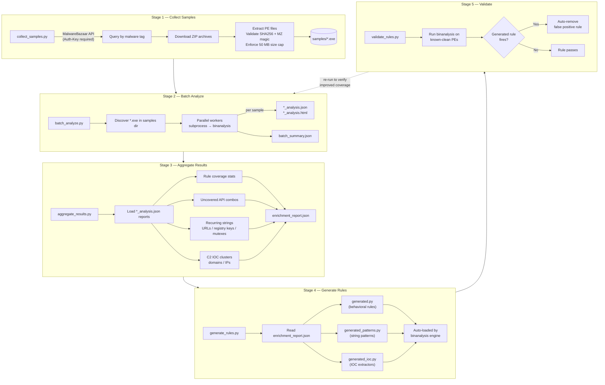

## Quick Start

```bash
cp .env.sample .env
# Set BAZAAR_AUTH_KEY

uv run python pipeline/run.py --tags AgentTesla --limit 50 --clean-dir clean_samples/
uv run python pipeline/run.py --tags Emotet Remcos AgentTesla --limit 100 --workers 4 --capa --yara --clean-dir clean_samples/
uv run python pipeline/run.py --tags AgentTesla --limit 50 --dry-run
uv run python pipeline/run.py --skip-collect --samples samples/
uv run python pipeline/run.py --skip-collect --skip-analyze --samples samples/
```

Use this pipeline when you are improving detection coverage, not for live alert triage. For active incident handling, use [../docs/guide.md](../docs/guide.md).

## Stages

### 1. Collect

```bash
uv run python pipeline/collect_samples.py --tag AgentTesla --limit 50
uv run python pipeline/collect_samples.py --tag Emotet Remcos --limit 100 --out samples/
```

### 2. Analyze

```bash
uv run python pipeline/batch_analyze.py --samples samples/ --workers 4
uv run python pipeline/batch_analyze.py --samples samples/ --workers 2 --capa --yara
```

### 3. Aggregate

```bash
uv run python pipeline/aggregate_results.py --reports samples/ --output enrichment_report.json
```

### 4. Generate

```bash
uv run python pipeline/generate_rules.py --report enrichment_report.json --dry-run
uv run python pipeline/generate_rules.py --report enrichment_report.json
uv run python pipeline/generate_rules.py --report enrichment_report.json --min-pct 15
```

Generated files:

- `binanalysis/formats/pe/rules/generated.py`
- `binanalysis/formats/pe/rules/generated_specimen.py`
- `binanalysis/generated_patterns.py`
- `binanalysis/generated_ioc.py`

### 5. Validate

```bash
uv run python pipeline/fetch_clean_samples.py --out clean_samples/
uv run python pipeline/validate_rules.py --clean-dir clean_samples/
uv run python pipeline/validate_rules.py --clean-dir clean_samples/ --report-only
```

If `run.py` gets an empty `--clean-dir`, it fetches clean samples automatically. Rules that fire on clean files are removed.

## Config

Use `.env` for API keys and overrides such as:

- `BAZAAR_AUTH_KEY`
- `MALSHARE_API_KEY`
- `VT_API_KEY`
- `SAMPLES_DIR`
- `BATCH_WORKERS`
